# Remind Application

Remind is a comprehensive Android application built to simplify daily productivity and time management. It provides users with a unified interface to organize tasks, maintain personal notes, and track time using built-in timer and stopwatch functionalities. The application leverages Firebase for secure user authentication and reliable cloud data synchronization, ensuring that your data remains accessible and safe across sessions.

## Core Functionality

The application is structured around four primary modules:

*   **Task Management**: Users can create, view, and organize daily tasks. The system allows scheduling specific times for each task and uses Android's local alarm system to deliver timely notifications.
*   **Notes**: A dedicated section for quickly saving text-based information, ideas, or reminders that do not require time-based alerts.
*   **Time Tracking**: Includes a precision timer for focused work sessions (such as the Pomodoro technique) and a stopwatch for general time measurement.
*   **Authentication & Security**: Utilizes Firebase Authentication to secure user data. The app also includes an internal App Lock feature for an additional layer of privacy.

> Note: To build and run this project locally, a valid `google-services.json` file must be placed in the `app/` directory. It has been excluded from version control for security purposes.

## Application Screenshots

| Splash & Login | Registration | Task Dashboard | Add Task |
| :---: | :---: | :---: | :---: |
| 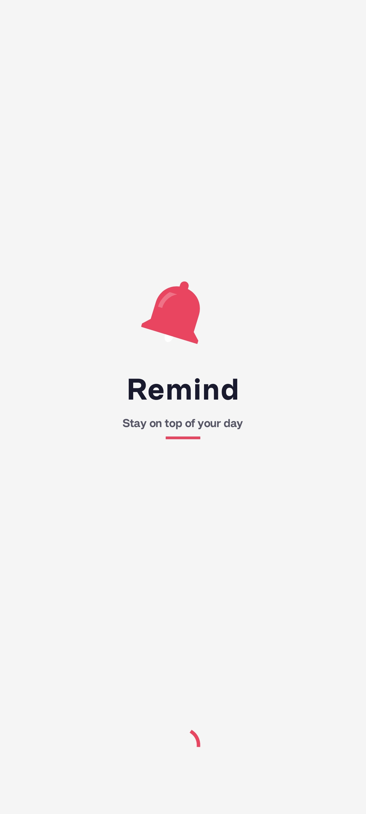 | 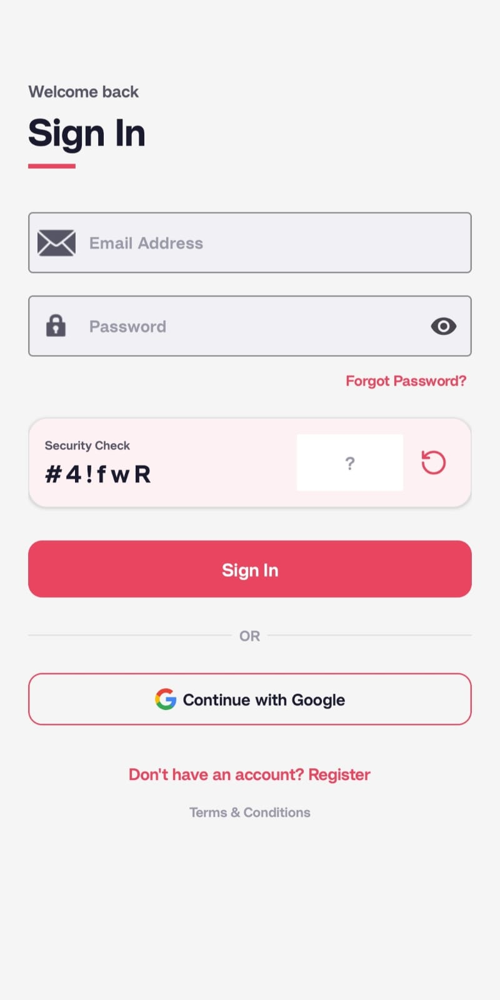 | 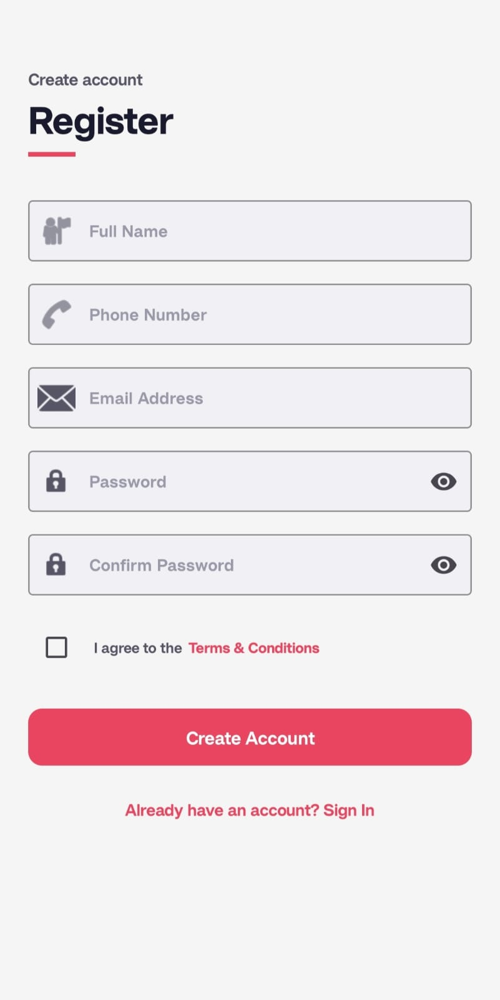 | 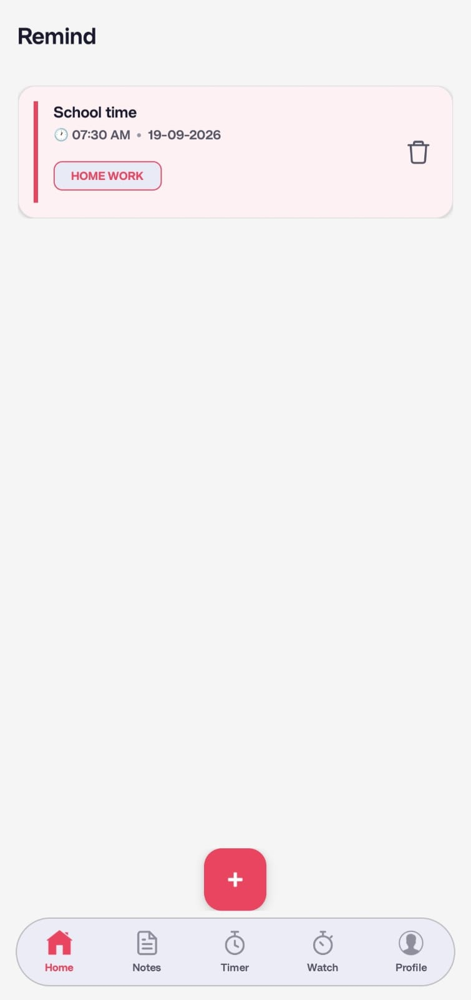 |
| **Loading Screen** | **Sign In** | **Registration** | **Task List** |

| Task Creation | Notes | Timer | Stopwatch |
| :---: | :---: | :---: | :---: |
| 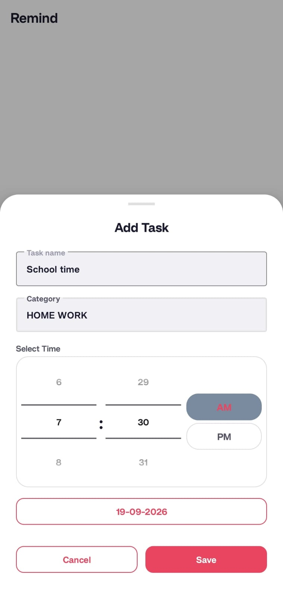 | 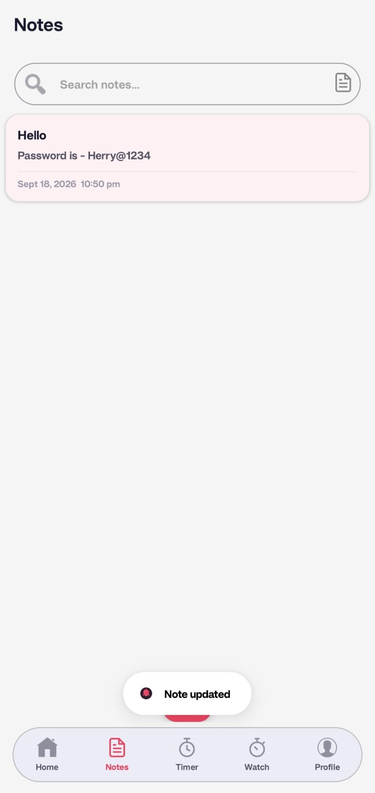 | 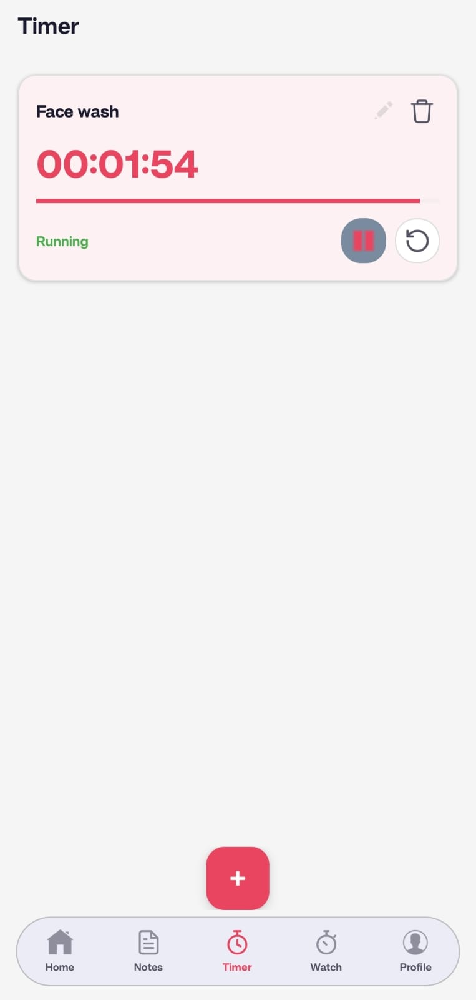 | 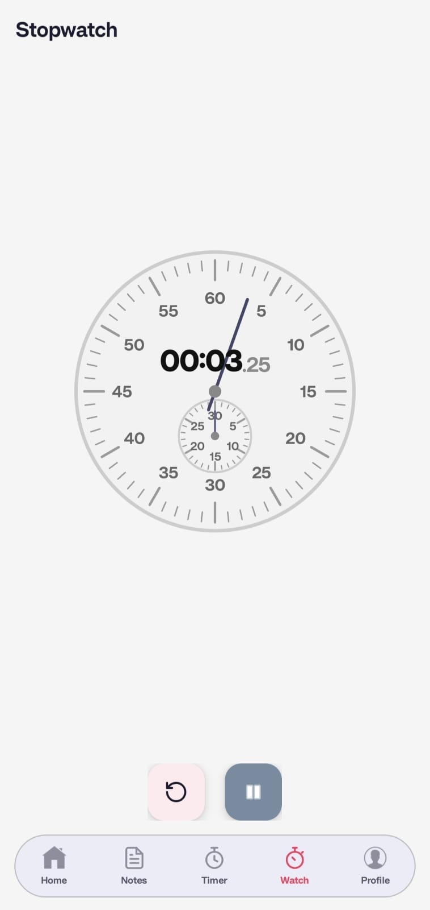 |
| **Add New Task** | **Notes Section** | **Timer Setup** | **Stopwatch** |

| Profile | Terms & Conditions | Settings | Additional Settings |
| :---: | :---: | :---: | :---: |
| 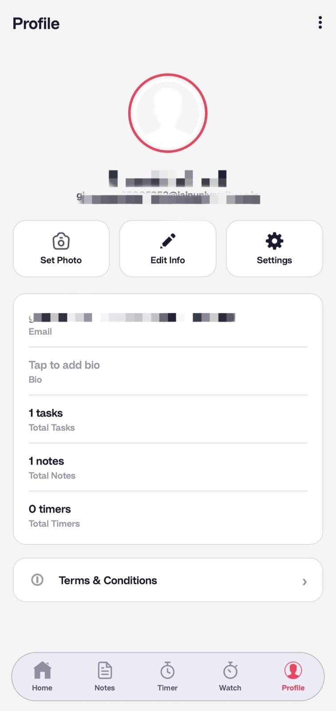 | 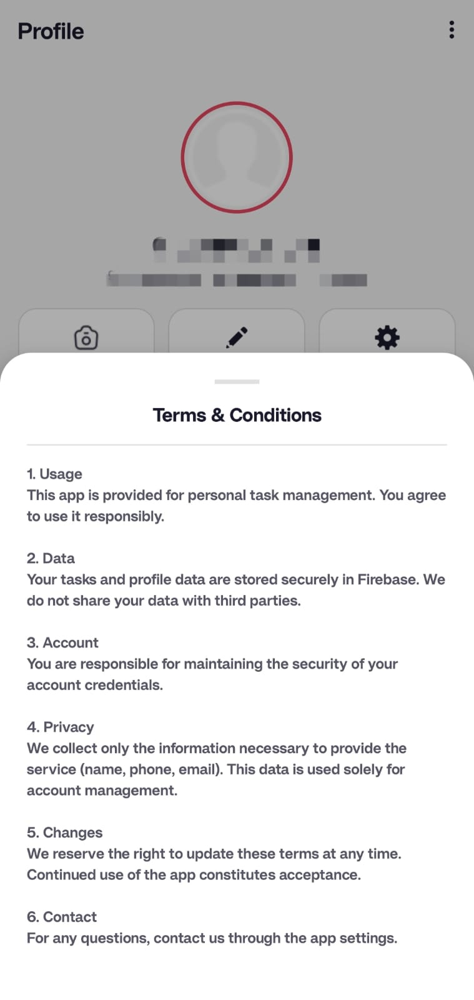 | 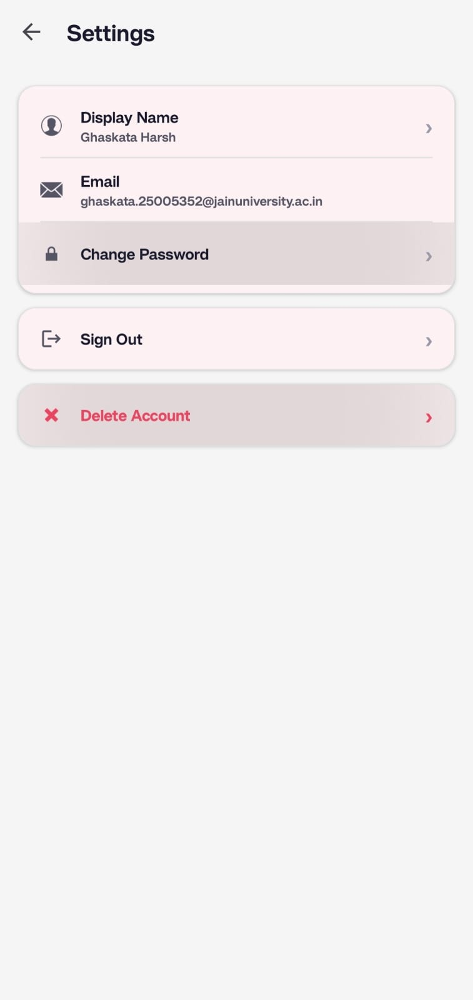 | 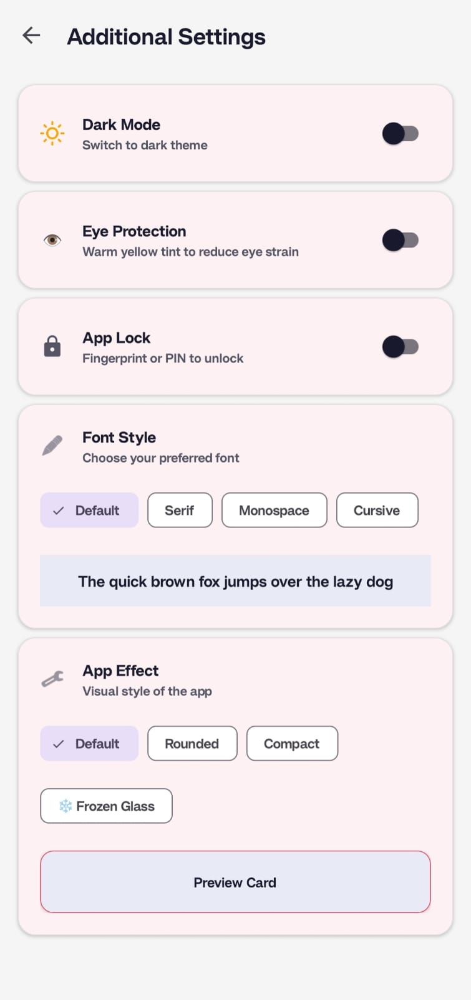 |
| **User Profile** | **Terms & Conditions** | **Settings** | **Additional Settings** |
